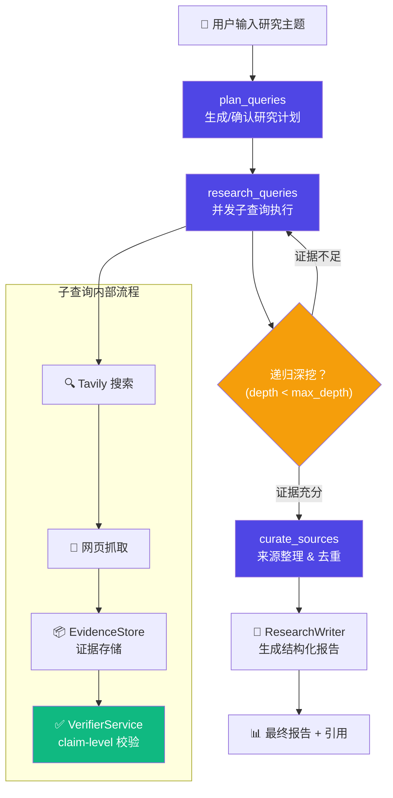

# Deep Research Agent

<div align="center">


**从零实现的深度研究 Agent，基于 LangGraph StateGraph 编排**

[架构](#-架构) • [核心能力](#-核心能力) • [快速开始](#-快速开始) • [部署指南](#-部署指南)

</div>

---

> **一句话定位**：一个从零实现的 Deep Research Agent，支持用户确认研究计划、并发子查询搜索、递归证据深挖、claim-level 引用校验、SSE 流式进度推送，以及 smoke eval 评测框架；研究流程通过 LangGraph `StateGraph` 编排（`plan_queries → research_queries → curate_sources`）。

## 📐 架构



**LangGraph StateGraph 节点说明**：

| 节点 | 职责 |
|------|------|
| `plan_queries` | 初始搜索 → 生成结构化研究计划（维度、搜索策略、预期成果）→ 用户可确认/编辑 |
| `research_queries` | 并发执行子查询，每个查询走 搜索→抓取→证据→校验 流程，支持递归深挖 |
| `curate_sources` | 汇总所有子查询结果，去重排序，更新 agent state |

## 📋 核心能力

| 能力 | 实现 |
|------|------|
| **LangGraph 工作流** | `StateGraph` 编排三阶段研究流程，状态在节点间显式传递 |
| **可确认研究计划** | 用户可审阅、编辑 AI 生成的子查询计划后再执行 |
| **并发子查询** | `asyncio.Semaphore` 控制并发，多维度同时搜索 |
| **递归深挖** | `deep_research_depth/breadth` 控制递归深度和广度，自动发现证据缺口 |
| **证据存储** | `EvidenceStore` 管理证据生命周期（searched → selected → read → cited/discarded） |
| **引用校验** | `VerifierService` + `ResearchWriter.evaluate_claim_support()` 进行 claim-level 质量评估 |
| **证据压缩** | 压缩长文本证据，保留关键信息供报告生成使用 |
| **流式进度** | SSE 实时推送研究进度（plan → search → analysis → report） |
| **成本追踪** | `CostTracker` 记录 token 用量和估算成本 |
| **Eval 框架** | 10 个 smoke eval 任务 + 自动打分器，覆盖多维度研究质量 |
| **持久化** | SQLite 持久化研究任务和 checkpoint，支持中断恢复 |

## 🛠️ 技术栈

| 层级 | 技术 |
|------|------|
| **Agent 编排** | LangGraph StateGraph |
| **LLM** | DeepSeek API（via LangChain） |
| **搜索** | Tavily Search API |
| **后端** | Python 3.10+ / FastAPI / uv |
| **前端** | React 18 / Tailwind CSS |
| **类型检查** | basedpyright（0 errors） |
| **测试** | pytest（113 passed） |

## ✅ 验证状态

```
uv run python -m pytest tests -q    → 113 passed
uv run basedpyright backend/app tests → 0 errors, 0 warnings
npm run build (frontend)             → Compiled successfully
```

## 🚀 快速开始

### 环境要求

- Python 3.10+
- Node.js 16+
- Git

### 1. 安装 uv

```bash
# macOS/Linux
curl -LsSf https://astral.sh/uv/install.sh | sh

# Windows
powershell -c "irm https://astral.sh/uv/install.ps1 | iex"

# 或使用pip
pip install uv
```

### 2. 克隆项目

```bash
git clone https://github.com/849261680/research-gpt.git
cd research-gpt
```

### 3. 一键设置环境

```bash
# 运行迁移脚本
chmod +x scripts/migrate-to-uv.sh
./scripts/migrate-to-uv.sh
```

### 4. 启动开发环境

#### 方式一：使用开发脚本（推荐）

```bash
./scripts/dev.sh
```

#### 方式二：手动启动

```bash
# 启动后端
./backend.sh

# 启动前端
./frontend.sh
```

### 5. 访问应用

打开浏览器访问：`http://localhost:3003`

## 📡 本地日志

项目不再提供 Prometheus、OpenTelemetry、Loki、Tempo 或 Grafana 组成的本地可观测性栈。排查报错和性能问题时使用应用日志。

后端日志默认输出在 `./backend.sh` 所在终端。需要保存到文件时：

```bash
./backend.sh 2>&1 | tee logs/backend.log
```

HTTP 请求会写入 `backend.http` 日志，包含 `method`、`path`、`status` 和 `duration_seconds`。需要更详细日志时：

```bash
LOG_LEVEL=DEBUG ./backend.sh
```

## 🧠 Agent 工作流

当前研究流程由 `backend/app/research/conductor.py` 中的 LangGraph `StateGraph` 编排：

```text
START
  → plan_queries
  → research_queries
  → curate_sources
  → END
```

- `plan_queries`：生成或加载用户确认后的结构化研究计划，并发出 `workflow_start` / `plan` 流式事件。
- `research_queries`：按计划并发执行子查询，保留递归 deep research、证据压缩和章节校验逻辑。
- `curate_sources`：汇总章节上下文和来源，生成最终可写作的 curated source list。

API 仍保持兼容，最终 payload 会同时标记 `architecture: "gpt_researcher"` 和 `workflow_engine: "langgraph"`。

## 🔧 开发工具

### 代码质量检查

```bash
# 后端类型检查
uv run basedpyright backend/app tests
```

### 测试

```bash
# 运行后端测试
uv sync
uv run python -m pytest tests -q
```

## 📁 项目结构

```
research-gpt/
├── pyproject.toml              # uv主配置文件
├── uv.lock                   # uv锁定文件
├── backend.sh                # 后端启动脚本
├── frontend.sh               # 前端启动脚本
├── scripts/                  # 开发脚本
│   ├── migrate-to-uv.sh     # uv迁移脚本
│   └── dev.sh              # 开发环境启动
├── backend/                   # 后端服务
│   └── app/               # 应用代码
└── frontend/                  # 前端应用
    ├── package.json         # Node.js依赖
    └── src/                # React源码
```

## ⚙️ 配置指南

### 环境变量

复制环境变量模板：

```bash
cp .env.example .env
cp backend/.env.example backend/.env
cp frontend/.env.example frontend/.env
```

编辑 `.env` 文件，填入你的 API 密钥：

本地开发默认端口与启动脚本保持一致：

```bash
PORT=8003
FRONTEND_URL=http://localhost:3003
REACT_APP_API_URL=http://localhost:8003
GOOGLE_OAUTH_REDIRECT_URI=http://localhost:8003/api/auth/google/callback
```

#### DeepSeek API

1. 访问 [DeepSeek 平台](https://platform.deepseek.com/)
2. 注册并登录账号
3. 在 API 管理中创建新密钥
4. 将密钥添加到 `.env` 文件中

#### Tavily Search API

1. 访问 [Tavily 官网](https://tavily.com/)
2. 注册获取免费 API 密钥（1000 次/月）
3. 将密钥添加到 `.env` 文件中

#### Google 登录

1. 在 Google Cloud Console 创建 OAuth Client，类型选择 Web application
2. 添加 Authorized redirect URI：`http://localhost:8003/api/auth/google/callback`
3. 将 `GOOGLE_OAUTH_CLIENT_ID`、`GOOGLE_OAUTH_CLIENT_SECRET`、`GOOGLE_OAUTH_REDIRECT_URI` 写入后端 `.env`
4. 生产环境把 redirect URI 改成你的后端域名，例如 `https://your-railway-domain.railway.app/api/auth/google/callback`

## 🚀 部署指南

### Railway（后端）

1. 连接 GitHub 仓库到 Railway
2. 保持根目录为仓库根目录（不要设置为 `backend`）
3. 使用仓库根目录下的 `Dockerfile` / `pyproject.toml` / `uv.lock` 进行构建；当前后端入口依赖模块路径 `backend.app.main:app`，如果把根目录切到 `backend`，会导致 `ModuleNotFoundError: No module named 'backend'`
4. 配置环境变量：
   ```
   DEEPSEEK_API_KEY=your_key
   DEEPSEEK_MODEL=deepseek-chat
   DEEPSEEK_TEMPERATURE=0.7
   DEEPSEEK_MAX_OUTPUT_TOKENS=4000
   DEEPSEEK_MAX_PROMPT_CHARS=24000
   RESEARCH_MAX_READ_PAGES_PER_SECTION=8
   TAVILY_API_KEY=your_key
   GOOGLE_OAUTH_CLIENT_ID=your_google_oauth_client_id
   GOOGLE_OAUTH_CLIENT_SECRET=your_google_oauth_client_secret
   GOOGLE_OAUTH_REDIRECT_URI=https://your-railway-domain.railway.app/api/auth/google/callback
   # PORT 由 Railway 自动提供，不需要手动设置
   FRONTEND_URL=https://your-vercel-domain.vercel.app
   ```
5. Railway 会自动提供生产端口；本地示例中的 `PORT=8003` 只用于开发环境
6. Railway 会自动使用仓库根目录配置构建并启动服务

### Vercel（前端）

1. 连接 GitHub 仓库到 Vercel
2. 设置根目录为 `frontend`
3. 配置环境变量：
   ```
   REACT_APP_API_URL=https://your-railway-domain.railway.app
   ```
4. Vercel 会自动构建和部署

## 🔧 常用命令

```bash
# uv相关
uv sync                    # 同步依赖
uv add package_name        # 添加新依赖
uv remove package_name     # 移除依赖
uv run command            # 在虚拟环境中运行命令

# 开发相关
./scripts/dev.sh          # 启动开发环境
uv run python -m pytest tests -q  # 运行后端测试
uv run basedpyright backend/app tests  # 后端类型检查

# 部署相关
uv build                 # 构建项目
uv publish               # 发布到PyPI（如果需要）
```

## 🐛 故障排除

### 常见问题

**Q: uv 安装失败**

```bash
# 确保系统有必要的依赖
# macOS
xcode-select --install

# Linux
sudo apt-get install build-essential
```

**Q: 依赖安装失败**

```bash
# 清理缓存重新安装
uv cache clean
uv sync --refresh
```

**Q: 前后端连接失败**

- 检查端口配置是否一致
- 确认 CORS 设置正确
- 查看浏览器控制台错误信息

## 📈 性能优化

### uv 优化配置

```toml
# pyproject.toml中的优化配置
[tool.uv]
cache-keys = ["git", "python"]
index-url = ["https://pypi.org/simple"]
```

### 开发环境优化

```bash
# 使用更快的索引
uv sync --index-url https://pypi.tuna.tsinghua.edu.cn/simple/
```

## 🤝 贡献指南

1. Fork 项目
2. 创建功能分支：`git checkout -b feature/amazing-feature`
3. 提交更改：`git commit -m 'Add amazing feature'`
4. 推送分支：`git push origin feature/amazing-feature`
5. 提交 Pull Request

## 📄 许可证

本项目采用 MIT 许可证 - 查看 [LICENSE](LICENSE) 文件了解详情。
